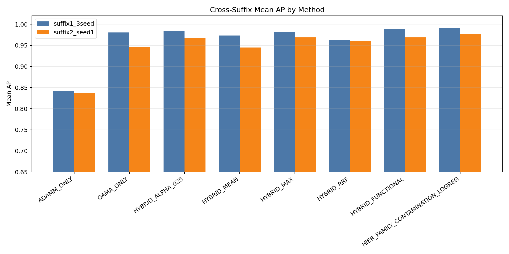
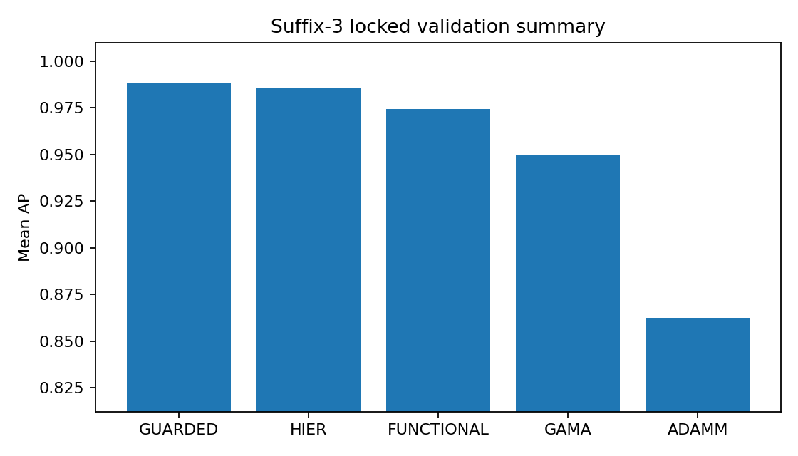

# GNN Anomaly Detection for Business Intelligence

This project combines ADAMM-style and GAMA-style anomaly scores for business process anomaly ranking.

It supports the work *Graph Neural Hybrid Anomaly Detection for Business Intelligence Event Logs* with code, replay inputs, compact result summaries, and a small runnable example.

```text
ADAMM score + GAMA score -> hybrid layer -> anomaly ranking
```

GAMA is useful for process event logs. ADAMM is useful for attributed multigraphs with metadata. This repository sits after those systems: it works with prepared score tables and tests simple ways to combine the signals.


## Why This Exists

GAMA and ADAMM look at graph anomalies from different angles. For business process data, those signals can complement each other. This project checks whether combining them gives a better ranking of suspicious cases.

## Quick Start

```powershell
python -m pip install -e .
python examples/run_demo.py
python scripts/replay_guarded_selector.py
```

`examples/run_demo.py` is the fastest way to see the idea on a tiny score table.

`scripts/replay_guarded_selector.py` runs in check-only mode by default. To replay the guarded selector from the included benchmark score table:

```powershell
python scripts/replay_guarded_selector.py --replay --fail-if-output-exists
```

## Main Result Snapshot

The strongest included score summary is:

```text
GUARDED_MARGIN_THRESHOLD_005
mean AP: 0.9886
```

The full summary is in [docs/RESULTS_SUMMARY.md](docs/RESULTS_SUMMARY.md).



## Main Pieces

`FunctionalHybridDetector`
: A small calibrated model that combines ADAMM and GAMA score features.

`HierarchicalHybrid`
: A context-aware variant that can use dataset family or contamination level.

`GuardedHybridSelector`
: A cautious selector that chooses between a stronger hybrid score and a safer fallback.

`Operational Cascade`
: A screen-first inspect-later flow: ADAMM-style scoring first, GAMA-style scoring or localization later.



## What Is Included

- hybrid scoring code in `src/adamm_gama_hybrid/`;
- a tiny runnable demo in `examples/`;
- replay and summary scripts in `scripts/`;
- result summaries and figures in `results/`;
- short notes in `docs/`.

Raw event logs and large trained models are not included.

## Useful Docs

- [Method overview](docs/METHOD_OVERVIEW.md)
- [How this supports the work](docs/WORK_ALIGNMENT.md)
- [Score table schema](docs/SCORE_TABLE_SCHEMA.md)
- [Results summary](docs/RESULTS_SUMMARY.md)

## Data

Raw event logs are not stored here. Use the original dataset sources and follow their licenses.

Useful starting points:

- https://www.processmining.org/event-data.html
- https://www.tf-pm.org/competitions-awards/bpi-challenge

## References

- GAMA: https://github.com/guanwei49/GAMA
- ADAMM: https://github.com/konsotirop/ADAMM
- GAMA paper: *GAMA: A Multi-graph-based Anomaly Detection Framework for Business Processes via Graph Neural Networks*
- ADAMM paper: *ADAMM: Anomaly Detection of Attributed Multi-graphs with Metadata: A Unified Neural Network Approach*
